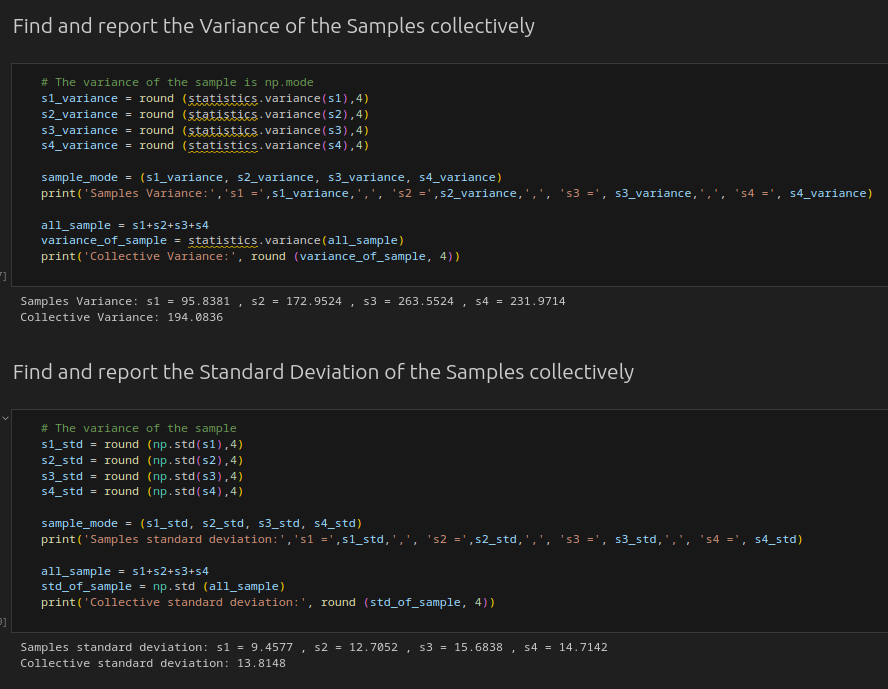

# Measure of Central Tendency

In this mini project, I delved into the exploration of essential statistical measures for sample data,
focusing on measures of central tendency such as the mean and mode,
as well as measures of variability including variance and standard deviation.

## Demonstration

Through meticulous analysis and computation, I gained insights into the core tendencies of the dataset.
The mean provided a comprehensive average that encapsulated the data's central value,
while the mode highlighted the most frequent data point.

Delving deeper, the variance quantified the spread of the data,
showcasing its dispersion from the mean,
and the standard deviation offered a standardized measure of this dispersion.

This project not only enhanced my understanding of these fundamental statistical concepts
but also demonstrated their critical role in drawing meaningful inferences from data.
